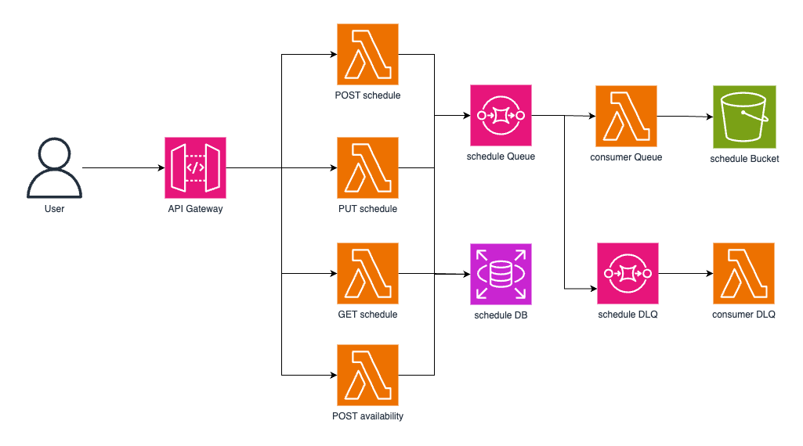

# Schedule Management API

## Introduction

This project implements a Schedule Management API using AWS services, including Lambda functions, API Gateway, Amazon Aurora PostgreSQL, SQS and S3. The API allows users to manage their weekly schedules, check availability at arbitrary timestamps, and ensures no overlapping schedules.

## Table of Contents

- [Architecture](#architecture)
- [Design Decisions](#design-decisions)
- [Assumptions and Limitations](#assumptions-and-limitations)
- [Deployment Instructions](#deployment-instructions)
- [API Endpoints](#api-endpoints)
- [Demo Video](#demo-video)

## Architecture



### Components

1. **API Gateway**: Provides REST-style endpoints to trigger Lambda functions.
2. **Lambda Functions**: Handle schedule management, availability checking and processing queue messages.
3. **Amazon Aurora PostgreSQL**: Stores user schedules.
4. **SQS**: Used for handling background tasks and failed message processing.
5. **S3**: Stores records of every mutation request payload.

### Infrastructure-as-Code

All resources are defined using an Infrastructure-as-Code (IaC) solution known as Serverless Stack(SST). This ensures the application can be deployed without manual configuration.

## Design Decisions

1. **Validation**: Schedules are validated to ensure no overlaps and correct time format.
2. **Timezones**: The API handles user schedules in their local timezone.
3. **Security**: Each Lambda function only has access to the resources it needs. This was achieved using the bind feature of SST constructs.
4. **Resilience**: SQS with DLQ is used to handle failed messages and ensure reliability.

## Assumptions and Limitations

- **Authentication and Authorization**: Not implemented as it was not required but it was simulated as the `user_id` is passed in the request header for the PUT and POST requests because it is assumed that the owner of the user account should be the only person that can modify their schedule. 
- **Database**: A single table was used due to the scope of the task. The table can contain multiple users.
- **Timezone Handling**: Assumes the client provides a valid timezone string. For the `availability` endpoint, the timezone passed by the API caller is converted to the user's timezone before the check is done to ensure that the API caller always has the right availability status for the user. A list of accepted timezone values can be found [here](https://gist.github.com/diogocapela/12c6617fc87607d11fd62d2a4f42b02a)
- **Timestamp**: Assumes the client will provide the timestamp in ISO-8601 format but without the offset in order to accommodate multiple timezones. For example, `2024-07-22T15:30:00`
- **Schedules**: Assumes the schedule will be provided in 24h format. A user can also have multiple schedules in a day but they must not overlap. A sample schedule can be found below:
```json
{
    "timezone": "Africa/Lagos",
    "schedule": {
          "monday": [{ "start": "09:30", "end": "18:00" }, { "start": "04:30", "end": "06:00" }],
          "tuesday": [{ "start": "13:00", "end": "17:00" }],
          "wednesday": [],
          "thursday": [],
          "friday": [],
          "saturday": [],
          "sunday": []
        }
}
```

- **DLQ**: The DLQ implementation just logs the event. In a real life scenario, an appropriate action would be triggered.

- **Users**: Three users - `user1`, `user2` and `user3` are added initially to the database. `user3` has been configured to throw an error which will be received in the DLQ.

## Deployment Instructions

### Prerequisites

- AWS CLI installed and configured.
- Node.js 18 or later.
- pnpm

### Steps

1. **Clone the repository**:
   ```bash
   git clone https://github.com/tobennanwokike/schedules-api.git
   cd schedules-api
   ```

2. **Install Dependencies**:
   ```bash
   pnpm install
   cd packages/core
   pnpm install
   cd ..
   cd ..
   cd packages/functions
   pnpm install
   cd ..
   cd ..
   ```
3. **Deploy**:
   ```bash
   pnpm sst deploy --stage prod
   ```

## API Endpoints

### Create/Update Schedule

- POST /schedule
- PUT /schedule

### Get Schedule

- GET /schedule/{user_id}

### Check Availability

- POST /schedule/availability/{user_id}


A postman collection containing the endpoints as well as their sample responses has been included in the root folder of this project. It can be imported and used to make sample requests.

## Demo Video

A demo video showcasing the application can be found [here]().